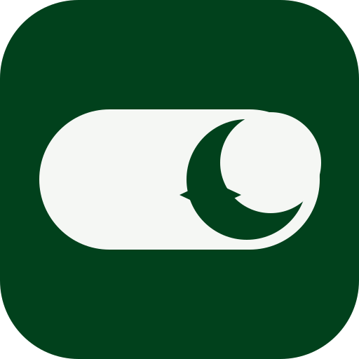

<div align="center">



# Toggle Docs

**Pakistan's own local-first document suite — an authentic Google Docs experience, entirely on your device.**

No cloud. No account. No internet. Your documents never leave your device.

[](https://github.com/Dattebayoolo/Toggle-Docs)
[](#-license)
[](https://developer.mozilla.org/en-US/docs/Web/JavaScript)
[](#-features)

</div>

---

## ✨ Why Toggle Docs?

Most editors want your data in *their* cloud. Toggle Docs flips that: it is a **100% local-first, offline-capable document editor** with the familiar look and feel of Google Docs — built with pure web technologies, zero frameworks, and zero dependencies.

<div align="center">

| 🔒 Private by Design | 🌐 Works Offline | 🇵🇰 اردو-first | ⚡ Zero Install |
|:---:|:---:|:---:|:---:|
| Everything stays in your browser's IndexedDB | Service Worker caching for full offline use | Built-in Urdu keyboard & Nastaliq | Just open a URL — it's a PWA |

</div>

## 🚀 Quick Start

```bash
# 1. Clone the repository
git clone https://github.com/Dattebayoolo/Toggle-Docs.git
cd Toggle-Docs

# 2. Start the local dev server
npm run dev

# 3. Open in your browser
#    → http://localhost:8765
```

> [!IMPORTANT]
> Opening `index.html` directly via `file://` will **not** work — browsers block ES modules on `file://` origins. Always serve over HTTP.

That's it. There is **no build, no bundler, and no dependencies to install**. The npm script just wraps the included Node static server.

## 🧭 Features

### 📄 Editor
- **Full Google Docs-style formatting toolbar** — headings, fonts, sizes, bold/italic/underline, colors, alignment, lists, indent, quotes, links, horizontal rules
- **Authentic paper view** with ruler, desk canvas & margins, just like docs.google.com
- **Autosave** with save-status indicator and debounced writes
- **Version history** — automatic snapshots you can browse and restore
- **Keyboard shortcuts** for everything, with a built-in shortcuts modal
- **Fullscreen** distraction-free mode

### 🏠 Dashboard
- **Template gallery** — blank, Urdu letter, résumé, proposal & notes starters
- **Recent documents feed** in grid or list view, with thumbnails and timestamps
- **Filters & search** — All / Starred / Trash tabs plus instant search
- **Navigation drawer** with document counts, backup & restore
- **Google-style account popover**, dark/light theme & language toggles

### 🇵🇰 Urdu Support
- **On-screen virtual Urdu keyboard** with phonetic rows & special keys
- **Nastaliq typography** for authentic calligraphic rendering
- **RTL documents** — right-to-left editing inside an LTR app shell
- **Full UI translation** (English ↔ اردو) persisted across sessions

### 🔐 Storage & Privacy
- **IndexedDB persistence** — documents, versions & settings
- **JSON backup & restore** of your entire library
- **Export** to HTML, plain text, or print to PDF
- **Service Worker** app-shell caching (offline-first, cache versioned)

## 🎨 Screenshots

> [!NOTE]
> Screenshots coming soon!

## 🧱 Tech Stack

<div align="center">


</div>

**Zero runtime dependencies.** No frameworks, no bundlers, no transpilation — just clean, modular vanilla ES modules.

## 📁 Project Structure

```
Toggle-Docs/
├── index.html            # Single-page app shell (dashboard + editor views)
├── manifest.json         # PWA manifest (installable app)
├── sw.js                 # Service worker (offline app-shell cache)
├── css/
│   ├── tokens.css        # Material 3 design tokens (light + dark themes)
│   ├── base.css          # Reset, base styles, responsive & print styles
│   ├── dashboard.css     # View 1: dashboard, templates, recent docs
│   ├── editor.css        # View 2: editor chrome, toolbar, paper, Urdu mode
│   └── overlays.css      # Modals, context menu, toasts, account popover
├── js/
│   ├── app.js            # Bootstrap: init, IndexedDB, event setup
│   ├── state.js          # Shared state, icons & UI helpers
│   ├── db.js             # IndexedDB storage layer
│   ├── settings.js       # Theme & language settings + persistence
│   ├── dashboard.js      # View switching, rendering, drawer
│   ├── editor.js         # Document engine & commands
│   ├── editor-events.js  # Editor wiring, menus & shortcuts
│   ├── documents.js      # CRUD, autosave, import/export, backup
│   └── urdu.js           # Urdu i18n strings & virtual keyboard
├── icons/                # PWA icons
└── tests/
    ├── server.js         # Zero-dependency static dev server
    ├── boot-check.mjs    # Boot smoke test (module graph + click simulation)
    └── smoke.ps1         # PowerShell smoke script
```

## 🧪 Development

```bash
# Start the dev server
npm run dev

# Run the boot smoke test (boots the whole module graph + simulates clicks)
npm test
```

The app is split into small ES modules with a single shared `state` object — every module mutates the same source of truth.

## 🗺️ Roadmap

See [ROADMAP.md](ROADMAP.md) for the full plan. Highlights:

- [x] Core editor with Google Docs-inspired chrome
- [x] Urdu keyboard & Nastaliq support
- [x] Offline PWA with IndexedDB storage
- [x] Dark mode & bilingual UI
- [ ] Real-time collaborative editing (local network)
- [ ] Folder organization & tagging
- [ ] More export formats (DOCX, Markdown)

## 🤝 Contributing

Contributions are welcome! The only rules:

1. **No frameworks, no build step** — keep it vanilla
2. Match the existing module structure and Material 3 token usage
3. Run the smoke test before opening a PR

## 📜 License

Released under the [MIT License](LICENSE).

---

<div align="center">

**Made with 💚 in Pakistan**

<sub>Toggle Docs — private, local, and free. Forever.</sub>

</div>
